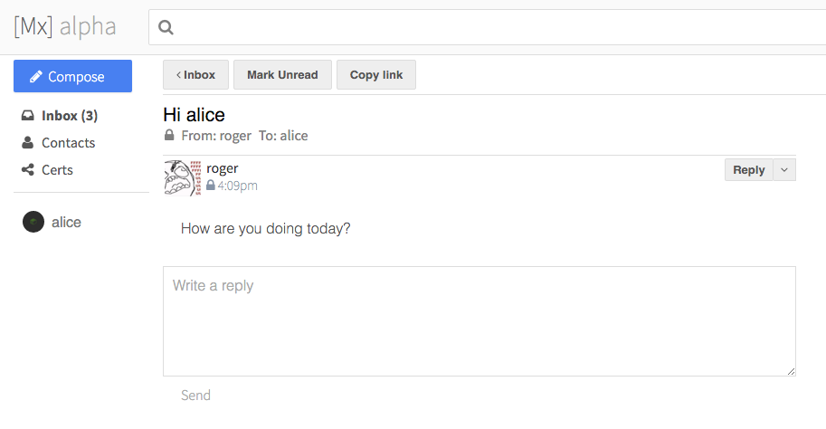

# MX mail

MX is an encrypted mail network.
It's not email, it's better!
But it's not finished yet, so dont try to download it.

## Secure mail, dumb hosts

MX is end-to-end encrypted.
Your private messages are unreadable, except to the recipients.

MX's user-authentication does not depend on third parties.
You collect proofs of identity from a social web-of-trust, and those proofs are stored on your device.

MX's protocol is extensible; the messages are semi-structured (as JSON) and typed.
You can use it to write applications other than just mail, by following the principles of the ["kappa architecture"](http://milinda.pathirage.org/kappa-architecture.com/).

MX's servers, called Pubs, are dumb-servers for smart-clients.
They handle very basic tasks like log- and file-replication.

**Protocol reference**
 - [Secure Scuttlebutt](https://scuttlebot.io/more/protocols/secure-scuttlebutt.html) p2p signed-log gossip
 - [Secret Handshake](https://scuttlebot.io/more/protocols/secret-handshake.html) transport layer security
 - [Private Box](https://scuttlebot.io/more/protocols/private-box.html) log-entry encryption
 - [Scuttlebot API](https://scuttlebot.io/) the embedded database/networking stack

### Signed logs

MX is built on the [secure scuttlebutt signed-log network](https://scuttlebot.io/more/protocols/secure-scuttlebutt.html).
It is a decentralized network, and has a looser host-dependency than e-mail.

Rather than attempting to route individual messages to specific hosts, MX writes the user's messages to a single append-only log.
The log is then gossiped uniformly to any peer that's interested in the messages.

### Encrypted mail

Private messages are encrypted onto the log with the [private box protocol](https://scuttlebot.io/more/protocols/private-box.html).
Private-box hides the data and metadata of the message; it doesn't reveal the content, subject line, or recipients.

When each log-entry is downloaded, the log's followers attempt to decrypt it with their private key.
If successful, then the the follower knows the message was for them; otherwise, the message is ignored (and can be discarded).

SSB log entries are simple JSON, so they are very general and extensible, and can represent more than just mail.
MX uses it for user-profiles, for instance, and to broadcast the social-graph relationships.

### Recipient authentication

MX uses a [web of trust](https://en.wikipedia.org/wiki/Web_of_trust) to authenticate users.
Users follow each other's SSB logs to form a "Cryptographic Social Network."
The "follows" are broadcasted publicly, for everyone to see.
Confidence in identities is created by aggregating positive signals (follows, "verifications") and negative signals (flags) from the user's social graph.

### "Pub" dumb servers

MX runs on the user device, not on a web host.
This is to protect the encryption keys (since browsers cant do that).
It also lets us have offline operation, and better performance, in some cases.

The SSB protocol is peer-to-peer, but there is no global DHT or NAT-traversal system.
It's therefore not possible to connect users' devices directly .
Instead, we use "Pub servers" on public IPs, and they rehost the users' logs.

Pub servers are unprivileged and not given any trust (nor should they be, since most of them are run on cloud VPSes).
They periodically sync their members' logs, and hold them indefinitely, for other users to request.
They can not read your mail, because the mail is encrypted with private-box.
The advantage they give is, they improve the network's uptime, and they keep users from having to reveal their IPs to each other.

You must register with a Pub to be active on the network.
If you know how to run nodejs on linux, then it's easy to setup one yourself; [here is the howto guide](https://scuttlebot.io/docs/config/create-a-pub.html).
You can change your pub, or use more than one, without disrupting your account.
Go to #scuttlebutt on freenode, for now, to ask for a pub membership.

### Introduction / user-discovery

The MX protocols (SSB) lack a centralized name registry.
Therefore users have to exchange contact info out-of-band.

### Automated bot users

Bots are easy to write for MX.
You can use them to create mailing lists, user-directories, and so on.
(Pubs are a kind of bot.)

Documentation is available on the [Scuttlebot site](https://scuttlebot.io/).
(Scuttlebot is a nodejs implementation of the SSB protocol, which MX embeds.)

---

Some todo ideas for the future.

### Verifications

It'd be useful if we could bind users' MX identities to other accounts, by sharing proofs of key-ownership through them.
This would improve the confidence in user identities.

For instance, you might assert, "I am bob@gmail.com," by publishing the claim on your log.
You'd send that log entry's JSON (which includes your signature) to me via bob@gmail.com.
I would input this proof into MX; I would confirm I received it from bob@gmail.com, and MX would confirm the message matches your log.

Afterward, MX would publish a verification-message on my log, saying that I confirmed your identity.
My followers would add that verification to their evaluation of your account.

### User directories

Taking verifications further, we can use directory-sites -- backed by their own logs -- to improve discovery.

The site would run a service for proving ownership of other accounts (twitter, email, github, etc).

The verifications would be broadcast on an ssb log.
Users could choose to follow the directory, in order to monitor and auto-download contact data.
Alternatively, they could go directly to the directory-site to lookup people.

To keep a directory's log from becoming too large to follow, it might be a good idea to run directories as small communities, or groups.
They might be part of a mailing-list, for instance.
The goal would not to be to create "one directory site to rule them all."

